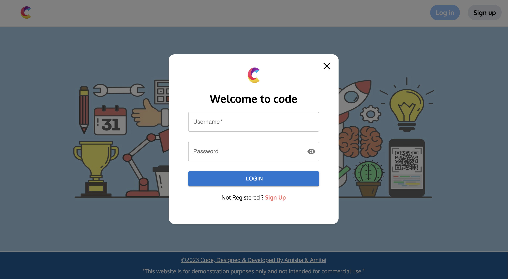

# Project Name

Brief project description goes here.



## Table of Contents

- [Features](#features)
- [Installation](#installation)
- [Usage](#usage)
- [Configuration](#configuration)
- [Contributing](#contributing)
- [License](#license)

## Features

- Feature 1
- Feature 2
- Feature 3

## Installation

Provide step-by-step installation instructions here. You can include code blocks.

```bash
npm install your-package-name
